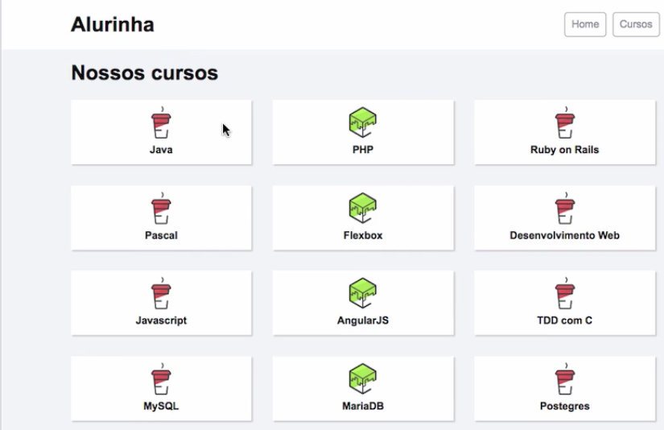
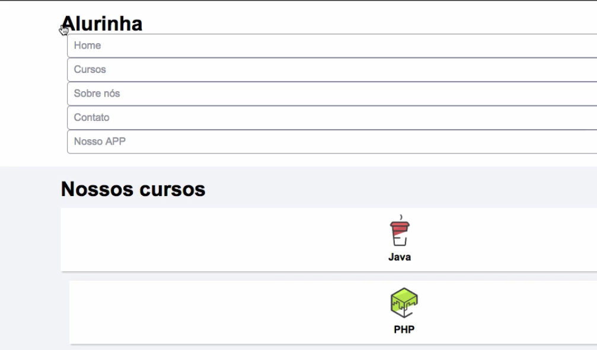
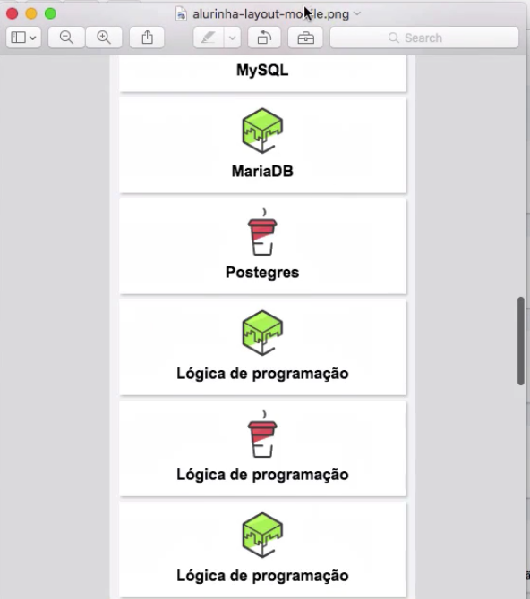

# Alurinha

Neste curso aprenderemos a manusear o flexbox, que é uma especificação CSS. A proposta do curso é o desenvolvimento do Alurinha, um gerenciador de cursos online, e nosso objetivo é alcançar o resultado abaixo:

Mas, o ponto de partida do projeto é o seguinte:

Ao longo das aulas organizaremos o site reposicionando os elementos da página e para isso utilizaremos o flexbox. 

Trabalharemos também com layout de Mobile e o resultado final deve ser o seguinte:

